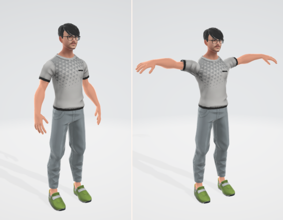

# T-pose Ready Player Me full-body glTF binary (.glb)

## Background

The avatar you can create from [Ready Player Me full-body avatar demo](https://fullbody.readyplayer.me/) glTF binary (.glb) defaults to A-pose. 
This tool make it to T-pose.



## Usage

```
> me2tpose -i A_pose.glb -c config.json
```

This generates glTF binary file which defaults to T-pose. Generated `*.bin` and `*.json` temporary files are only for debugging purpose.

## Options

* `--input `: input glTF binary (.glb) file name
* `--config`: Bone configuration (JSON)

Bone configuration JSON contains rotation of the bones in order to convert to A-pose as _quaternion_. You can get quaternion value visually from [quaternions.online](https://quaternions.online/).

```json
{
	"pose": {
		"LeftArm":  [ -0.386, 0, 0, 0.923 ],
		"RightArm": [ -0.386, 0, 0, 0.923 ]
	}
}
```

## License

* me2tpose is available to anybody free of charge, under the terms of MIT License (see LICENSE).
* Ready Player Me full-body avatar is licensed under [Attribution-NonCommercial-ShareAlike 4.0 International (CC BY-NC-SA 4.0)](https://creativecommons.org/licenses/by-nc-sa/4.0/) by [Wolfprint 3D](https://wolf3d.io/).

## Building

You need [Cmake](https://cmake.org/download/) and Visual Studio with C++ environment installed. There is a CMakeLists.txt file which has been tested with [Cmake](https://cmake.org/download/) on Windows. For instance in order to generate a Visual Studio 10 project, run cmake like this:


```
> mkdir build; cd build
> cmake -G "Visual Studio 10" ..
```
